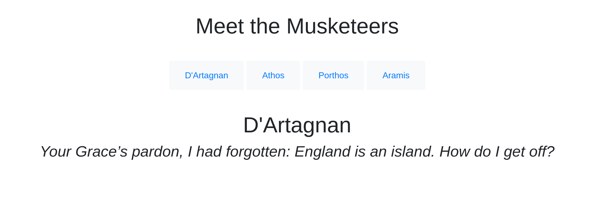

# Templates in Go

This repository is to demonstrate two approaches to using the [template package]("https://golang.org/pkg/text/template/") for web development in Go.

Templates are a powerful force for generating textual output, and can run functions as well as display input values. They're useful for a modular approach to development can render wire-framing and building websites a more fun endeavor.

The 'single_template' example shows an approach suited to single-page apps, where the screen may remain the same while inputs (displayed information) change. A suitable example may be a recipes site where each screen is a photo of the dish, and list of ingredients followed by instructions. This sample project displays Musketeers' names, and one of their best quotes from the countless contenders. 




Here the only HTML we need is in base.html (abridged to remove the usual boilerplate and bootstrap import):

```
<body>
    <div class="container text-center" style="margin-top: 40px !important;">
        <div class="container text-center">
            <h1>Meet the Musketeers</h1>
        </div>
        <div class="container text-center" style="margin-top: 40px !important;">
            <button type="button" class="btn btn-light"><a class="nav-link" href="dartagnan">D'Artagnan</a></button>
            <button type="button" class="btn btn-light"><a class="nav-link" href="athos">Athos</a></button>
            <button type="button" class="btn btn-light"><a class="nav-link" href="porthos">Porthos</a></button>
            <button type="button" class="btn btn-light"><a class="nav-link" href="aramis">Aramis</a></button>
        </div>
        <div class="container text-center" style="margin-top: 40px !important;">
            <h1>{{  .Name  }}</h1>
            <h3 class="font-italic">{{  .Quote  }}</h3>
        </div>
    </div>
</body>
```

The key lines here are towards the bottom, showing where the {{.Name}} and {{.Quote}} inputs will be populated.

To see the live example, with Go [installed]("https://golang.org/dl/"), cd into the folder and type:

```
go run main.go
```

then navigate to localhost:3000 in a browser. In this fashion, with the help of a database connection, we could in theory run thousands of unique screens/routes from just one HTML template.


For applications with a more complex array or screens, a component-based template architecture may be more suitable. We can create different .html templates for the header, footer, a carousel, anything else necessary, and slot them together like Lego blocks. 

In the component_templates folder, we have a sample artist's portfolio application. Let's look at works.html, which will feature a series of cards showing the artist's work. An abridged version:

```
{{ define "works" }}

    {{ template "header" }}

    {{ template "jumbotron" }}
    
        <div class="container">
            ...cards showing work etc...
        </div>

    {{ template "footer"}}
{{ end }}
```

To see the site running, cd into the directory and type

```
go run main.go
```

then navigate to localhost:8080 in a browser.

This is another fun and quick way to build Go frontends. They're modular, easy to adjust, and test. 

